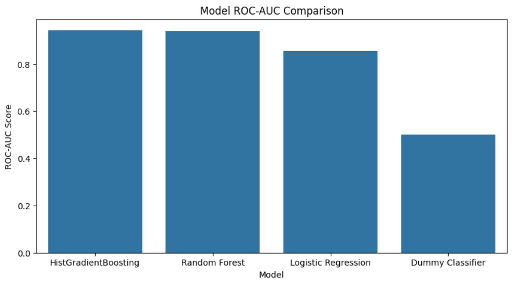
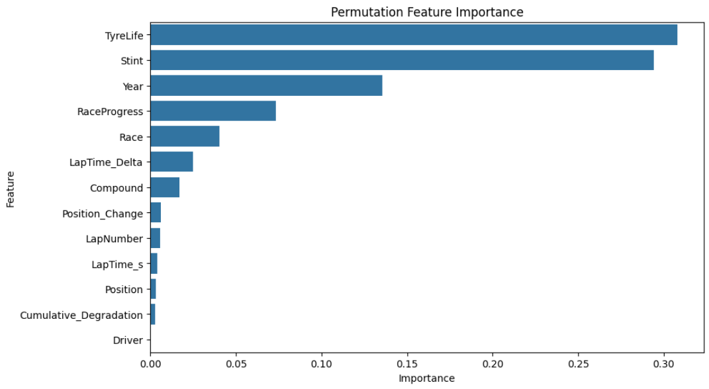
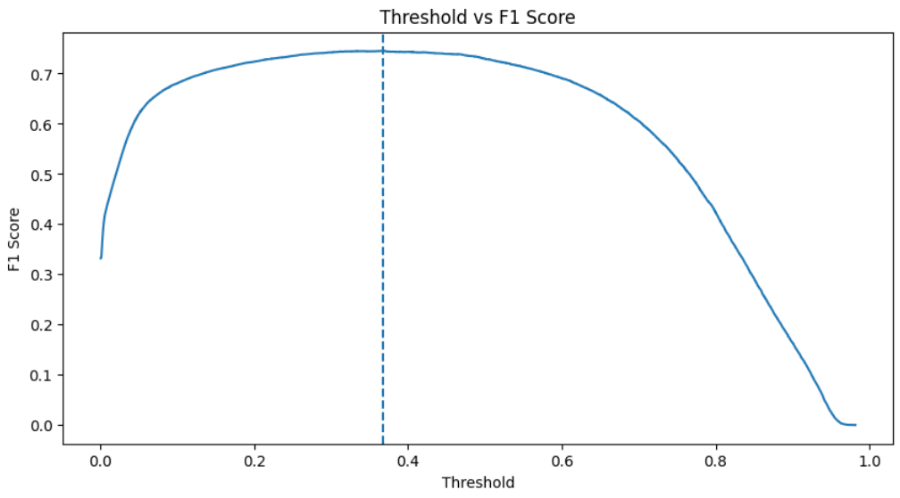

# 🏎️ Predicting F1 Pit Stops

This project predicts whether a Formula 1 driver will pit on the next lap using data from the Kaggle Playground Series - Season 6 Episode 5 competition.

The project was designed as a portfolio-ready machine learning case study focused on structured tabular classification, model optimization, and practical evaluation workflows.

---

# 📌 Project Goal

Pit stop timing is one of the most important strategic decisions in Formula 1 racing.

The objective of this project is to predict:

> Will a driver pit on the next lap?

The problem is framed as a binary classification task using race, tire, lap timing, and strategy-related features.

---

# 📊 Dataset Information

- Competition: Kaggle Playground Series - Season 6 Episode 5<br>
- Task: Binary Classification<br>
- Rows: 439,140<br>
- Features: 13 modeling features<br>
- Target: `PitNextLap`<br>

Because the dataset comes from a Kaggle competition, raw data files are not included in this repository.

---

# ⚙️ Project Workflow

1. Data Understanding and EDA<br>
2. Feature Engineering and Preprocessing<br>
3. Model Training and Evaluation<br>
4. Model Tuning and Optimization<br>
5. Final Submission Generation<br>

---

# 🤖 Models Evaluated

- Dummy Classifier<br>
- Logistic Regression<br>
- Random Forest Classifier<br>
- HistGradientBoostingClassifier<br>

Final selected model:

> HistGradientBoostingClassifier

---

# 🏁 Final Model Performance

| Metric | Score |
|---|---|
| Accuracy | 0.8886 |
| Precision | 0.6840 |
| Recall | 0.8185 |
| F1-Score | 0.7452 |
| ROC-AUC | 0.9451 |

The final model included:

- Hyperparameter tuning<br>
- Threshold optimization<br>
- Permutation feature importance analysis<br>

---

# 📈 Key Findings

- `TyreLife` was the strongest predictive feature.<br>
- Tree-based ensemble models significantly outperformed linear models.<br>
- Threshold optimization improved F1-score more effectively than hyperparameter tuning alone.<br>
- Tire usage and race progression features were stronger predictors than driver identity.<br>

---

# 🖼️ Visualizations

## Model Comparison



## Feature Importance



## Threshold Optimization



---

# 🛠️ Tools and Libraries

- Python<br>
- Pandas<br>
- NumPy<br>
- Matplotlib<br>
- Seaborn<br>
- Scikit-learn<br>
- Kaggle Notebooks<br>

---

# 📂 Repository Structure

```text
f1-pit-stop-prediction/
│
├── notebooks/
│   ├── 01_data_understanding_eda.ipynb
│   ├── 02_feature_engineering_preprocessing.ipynb
│   ├── 03_model_training_evaluation.ipynb
│   ├── 04_model_tuning_optimization.ipynb
│   └── 05_final_submission.ipynb
│
├── images/
├── submissions/
├── README.md
├── requirements.txt
└── .gitignore
```

---

# 🚀 Future Improvements

Possible future improvements include:

- Testing XGBoost, LightGBM, and CatBoost<br>
- Creating rolling race pace features<br>
- Adding sequential race history features<br>
- Exploring probability calibration techniques<br>
- Experimenting with time-aware validation strategies<br>

---

# 🌟 Final Remarks

This project demonstrates a complete end-to-end machine learning workflow using structured Formula 1 racing data.

The final HistGradientBoosting model achieved strong predictive performance while balancing precision and recall effectively for pit stop prediction.
